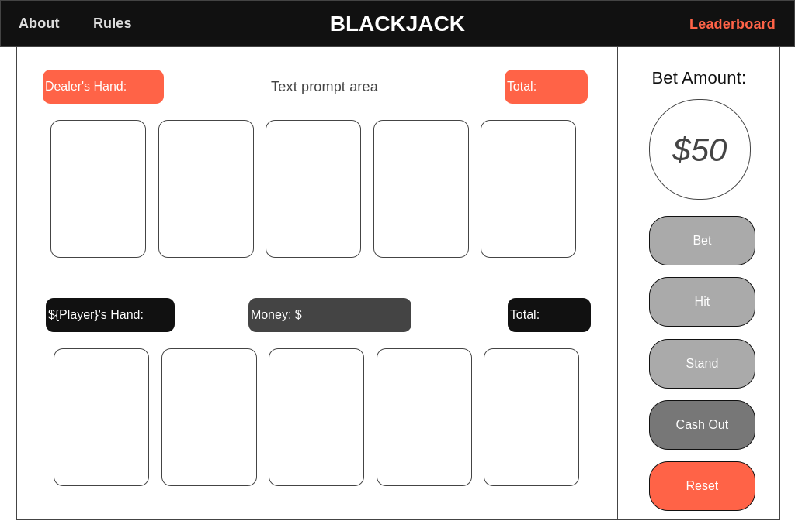

# Developing a Card Game: Blackjack

## Project Brief
**MVP - Minimum Viable Product**
- Built with HTML, CSS & JavaScript
- Utilizing JS for DOM manipulation
- Hosting via GitHub page (& frequent commits)
- A README.md that will detail tech used, how-to-play guide, game model, project timeframes, approaches, issues, and more.
- To be displayed in browser
- Have user interaction via clicks/taps
- Game selected must have a win-lose condition

**Stretch Goals**
- More Game Features: Split Pairs, Double Down (player only), Insurance logic
- Incorporate animation & sound effects (ie, card shuffling, card dealing, card reveal, winner win, winner lose)
- Explore show/hide buttons for currently disabled buttons - cleaner UI
- Accessibility option: visual countdown timer on displaymessages with settimeout attached
- Add dark mode
- Look into cookie data & server storage instead of client side localStorage

**Super Stretched Goals**
- Enhance Dealer AI: Improved decision-making
- Multiplayer Features: Add networked multiplayer function for real-time gameplay with friends

## Timeline
2 Weeks

## Tech & Tools Utilized
- HTML
- CSS
- JavaScript
- Git + GitHub

## Description

###### Origins

Blackjack, also known as 21, is a classic card game that has its roots in the casinos of France in the 1700s, where it was originally called "Vingt-et-Un" (French for twenty-one). The game made its way to America in the 18th century, where it became an instant favorite in illegal gambling dens. It wasn't until Nevada legalized gambling in 1931 that Blackjack found a legitimate and permanent home in casinos.

###### A Game of Memories and Friendship

Blackjack holds a special place in my heart because it’s more than just a game—it’s a nostalgic reminder of countless weekends spent with friends. Every Friday or Saturday evening, we would gather around to play Blackjack (and sometimes Poker), sharing laughter, strategies, and unforgettable moments.

I still vividly recall one night when we started at 5 PM and didn’t realize until the sun came up that we had been playing for 12 hours straight! The camaraderie, the thrill of a good hand, and even the occasional friendly banter made these sessions an integral part of my social life. 

###### Recreating the Experience in Code

When it came time to pick a project while attending the Software Engineering Bootcamp by General Assembly, Blackjack felt like a perfect fit. It wasn’t just a fun game but also a way to capture and recreate those cherished memories in a digital format. From designing the betting mechanics to implementing multiplayer support, I found myself reliving those late-night sessions while bringing the game to life.

On a technical level, Blackjack also offered the right balance of challenge and engagement. Developing features like real-time score tracking, betting, and a persistent leaderboard allowed me to combine logic, creativity, and user-centric design. Adding the multiplayer aspect not only aligned with my memories of playing with friends but also made the game more dynamic and inclusive.

###### Preserving the Fun

This project is more than just a coding endeavor; it’s my way of preserving and sharing the joy and excitement I experienced during those weekends. I hope that anyone who plays it can feel the same sense of connection and fun that Blackjack brought to my life.

## Wireframe

<!-- [Link](https://wireframe.cc/pro/pp/e934692fd853844) - not working, need paid plan -->

 

## In-Game Snapshots

## Deployment

The game is deployed on GitHub pages, URL: https://shondoe11.github.io/blackjack-game/

 

## How To Play Classic Blackjack: A Guide for Players

###### Objective
The goal of Blackjack is to beat the dealer's hand without going over 21. Players aim to have a hand total that is higher than the dealer’s without busting (exceeding 21).

###### Starting the Game
1. Joining the Game: 
- Up to 7 players, including the dealer, can participate.
- The dealer is controlled by the game.
2. Initial Setup:
- Each player starts with $5000. 
- Before any cards are dealt, players will input their names and place their initial bets.
- The minimum bet amount is $50, but players can choose to bet any amount up to all their current money ("All-In")

###### Gameplay
1. Dealing Cards:
- Each player, except the dealer, receives two cards face up.
- The dealer receives one card face up and one card face down.
2. Player Decisions:
- Hit: Players can choose to take additional cards one at a time to get closer to 21.
- Stand: Players can choose to stop taking additional cards if they are satisfied with their current total or wish to avoid busting.
- All-In: At any betting opportunity, players can bet all their current money.
3. Dealer's Play: 
- After all players have made their decisions, the dealer reveals the hidden card and must hit if the total is 16 or less and stand on totals of 17 or more.

###### Betting Rules
1. Winning and Losing Bets:
- If the dealer busts, all remaining players win and are paid out equal to their bet.
- If a player busts, they lose their bet.
- If the dealer does not bust, players with a total higher than the dealer's win an amount equal to their bet. 
- Players with a total lower than the dealer's lose their bet.
2. Special Payouts
- Blackjack: If a player has a Blackjack (an Ace and a 10-value card) as their initial hand, they are paid at 3 to 2 (1.5x of original bet).
3. Standoff: If a player and the dealer have the same total, the bet is returned to the player without adjustment.

###### Ending the Game
1. Cashing Out
- Players can choose to 'cash out' their total money to the leaderboard at any point if they decide to stop playing.
- This action records their name and total money on the leaderboard.
2. Resetting the Game
- Players can press the reset button to start a new game with initial settings. *Leaderboard remains unaffected, preserving the top 10 scores*

###### Leaderboard
- The top 10 player scores are displayed on the leaderboard.
- Names and scores are cached indefinitely, unless displaced by higher scores.

 

## Development

#### Initial Timeline

- [x] **Step 1**: Generate Standard 52 Card Deck and Game Setup (JS)
1. Develop the functionality to create and shuffle a 52-card deck. (JS)
2. Initialize player settings (money, name input) and set up betting parameters. (JS)
* [Step 1 Timeline: 2 days]

- [x] **Step 2**: Develop User Interface
1. Design and implement the main game interface. (HTML, CSS)
2. Create buttons and displays for player actions, bets, and card handling. (HTML, CSS)
* [Step 2 Timeline: 2 days]

- [x] **Step 3**: Implement Betting Mechanics and Gameplay Mechanics
1. Code the betting functions (including placing and adjusting bets). (JS)
2. Implement 'Hit', 'Stand', and basic dealer gameplay logic. (JS)
* [Step 3 Timeline: 2 days]

- [x] **Step 4**: Integrate Betting Rules and Leaderboard Development
1. Incorporate all special betting rules and payouts into the game logic. (JS)
2. Develop the leaderboard to track and display top scores. (JS, HTML, CSS)
* [Step 4 Timeline: 2 days]

- [x] **Step 5**: Testing & Debugging (Initial Phase)
1. Conduct initial testing to identify major bugs and gameplay issues. (JS, HTML)
2. Start fixing critical bugs as they are identified. (JS, HTML)
* [Step 5 Timeline: 2 days]

- [x] **Step 6**: Continued Testing, Debugging, and Optimization
1. Continue detailed testing across all game functions. (JS, HTML)
2. Optimize performance and enhance UI (only if ahead of schedule) (HTML, CSS)
3. Finalize leaderboard integration and ensure it functions across sessions.

- [x] **Step 7**: Final Review & Launch Preparation
1. Conduct final playtests, possibly with external testers.
2. Make last-minute adjustments based on feedback.
3. Prepare and execute game launch.

 

## Key Learnings
1. Managing Complexity Through Modular Design
- What I Learned:

Breaking down the project into multiple files, each with a clear purpose (e.g., gameLogic.js for core game mechanics, uiController.js for rendering the UI, and leaderboard.js for score management), helped manage the complexity of the codebase.
Using ES6 modules and maintaining strict separation of concerns ensured that each file was responsible for a single part of the application, making debugging and updates easier.

- How I Applied It:

The modular structure allowed features like the leaderboard and deck shuffling to evolve independently, minimizing the risk of unintended bugs in unrelated parts of the project. 

Check out: [JS-file-structure](./JS-file-structure/JS-file-structure.md)

2. Dynamic State Management
- What I Learned:

Managing dynamic states for multiple players, the dealer, and the game itself requires careful planning.
Ensuring that the state transitions smoothly during each phase of the game (etc, placing bets, dealing cards, player actions) taught me how to think systematically about game flow.

- How I Applied It:

Functions like checkWinner() and handleHit() demonstrated how to track and update player and dealer states while syncing them with the UI in real-time.

 

3. Real-Time UI Updates and DOM Manipulation
- What I Learned:

Rendering dynamic elements like player hands, dealer cards, and the leaderboard required proficiency in DOM manipulation.
Efficiently updating the UI without creating performance bottlenecks or inconsistencies was a valuable lesson.

- How I Applied It:

The updateHandUI() function dynamically rendered card images and handled edge cases like the dealer’s hidden card. CSS animations and responsive styling enhanced the visual appeal of the interface.

4. Data Storage
- What I Learned:

Leveraging localStorage to persist the leaderboard across game sessions helped me understand client-side storage and its limitations.
Keeping the leaderboard accurate and consistent required careful handling of saving and loading data.

- How I Applied It:

The leaderboard.js file used localStorage to save and retrieve the leaderboard, ensuring that players' scores were cached indefinitely.

Check out: [leaderboard.js](./JS-file-structure/leaderboard.js)

5. Balancing Game Flow
- What I Learned:

Managing a smooth game flow, especially in a multiplayer setting, required thinking through transitions between players and the dealer’s turn.

- How I Applied It:

Functions like nextPlayerTurn() ensured that the game progressed seamlessly from one player to the next while handling edge cases like busted players or cash-outs.

## Summary

This project was not just an exercise in building a game but a holistic learning experience in software development; blending programming, problem-solving, and user experience design. Total duration taken: 3 weeks.

## Attributions

All assets used in this project are credited to their respective original sources.

#### Game Mechanics
- [MDN Game Development](https://developer.mozilla.org/en-US/docs/Games)
- [Online Blackjack casino operations analysis](https://wizardofodds.com/play/blackjack/)

#### HTML
- [Blackjack logo](https://images.app.goo.gl/ZchEyB6cEzecDoz8A)
- [Card deck images](https://code.google.com/archive/p/vector-playing-cards/downloads)
- [Back of card image](https://images.app.goo.gl/ikCFomk6CKoioptw7)

#### CSS
- [Button animations ('pressed' and 'arrow on hover' effects)](https://www.w3schools.com/howto/howto_css_animate_buttons.asp)
- [Popups](https://www.w3schools.com/howto/howto_js_popup.asp )

#### JS
- [ThatSoftwareDude](https://www.thatsoftwaredude.com/content/6417/how-to-code-blackjack-using-javascript)
- [Fisher-Yates Shuffle](https://bost.ocks.org/mike/shuffle/): good resource (maybe a little outdated) for comparing different types of shuffling techniques
- [setTimeout](https://developer.mozilla.org/en-US/docs/Web/API/Window/setTimeout)
- [localStorage](https://developer.mozilla.org/en-US/docs/Web/API/Window/localStorage)

<!-- Internal Dev Notes -->